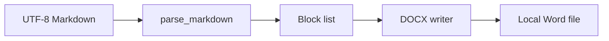

# Architecture: md2docx-cn

## Overview

`md2docx-cn` 是一个本地运行的单进程 Python CLI。它读取 UTF-8 Markdown，
解析受控的文章块，再用 `python-docx` 输出 Word 文件。没有网络、数据库、账号或
后台服务。

## Components

| Component | Responsibility | Tech |
|---|---|---|
| `cli.py` | 参数解析和命令行反馈 | Python `argparse` |
| `converter.py` | Markdown 块解析、样式配置、DOCX 写入 | Python、python-docx |
| `tests/` | 行为和回归验证 | Python `unittest` |

## Data flow

## Decisions

- 使用 `src/` 布局，避免从仓库根目录意外导入未安装代码。
- 使用标准库 `unittest`，克隆后不需要额外测试框架。
- 首个版本不使用 Docker：工具只读写本地文件，容器会增加 Windows 使用门槛。
- 不实现完整 Markdown 规范；先覆盖中文文章最常见结构。
- 免费核心采用 MIT，收入来自模板定制、批量自动化和支持。

## Security

- 不访问网络，不读取输入和输出路径之外的文件。
- 不收集遥测，不保存密钥。
- 输出目录仅在用户明确指定的位置创建。

